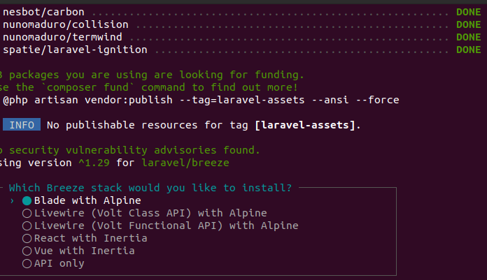
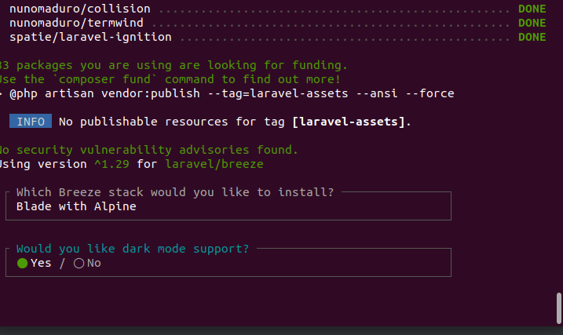
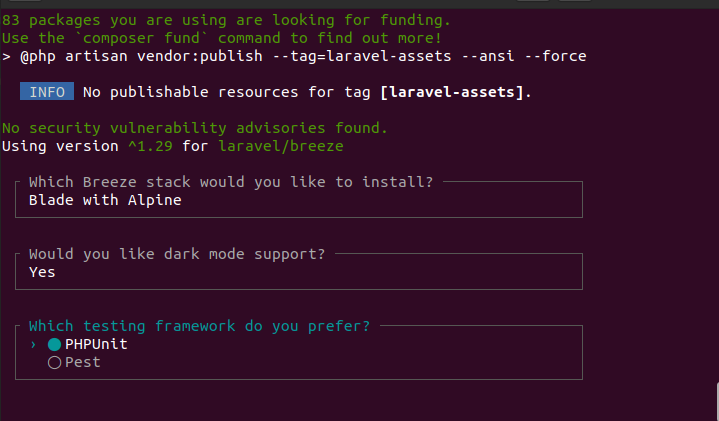

# Laravel by Fortis Solution

[TOC]

## Tested Laravel 10.*

## How to install

1. Open terminal
2. Run 

```shell
$ sh laravel.sh
$ Masukkan nama aplikasi Laravel: <input project name>
$ DB HOST: <input db host>
$ DB PORT: <input db port>
$ DB DATABASE: <input db database>
$ DB USERNAME: <input db username>
$ DB PASSWORD: <input db password>
```



Choose Blade with Alpine



Choose Yes



Choose PHPUnit

4. Wait until finish installing

4. Run Laravel

```shell
$ php artisan serve
```

5. Register new user
6. Login